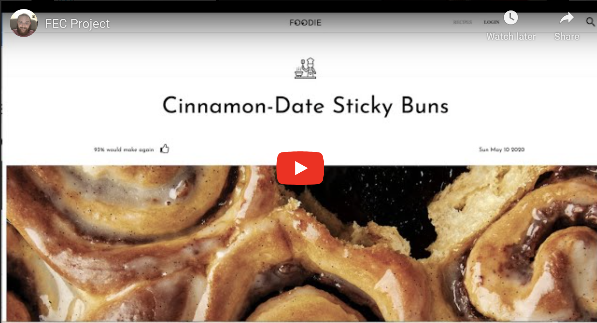

# FOODIE

> This is a redesign of bon appetits recipe page. This project was worked on with two other team mates during Hack Reactor (HRR45). It is broken up into the three modules listed below. They are all combined onto this proxy server to make one Application.

See My Contributions To The Foodie Application

## Related Projects

> I've included all of these modules locally so you only need to clone this one repo.

  - https://github.com/JustinPaoletta/top-styling-and-reviews.git
  - https://github.com/JustinPaoletta/ingredients-carousel-and-equipment-list.git
  - https://github.com/JustinPaoletta/recipe-steps-w-video-carousel.git

## Table of Contents
1. [Overview](#Overview)
1. [PreReqs](#PreReqs)
1. [Development](#Development)
1. [Setup&Runtime!](#Setup&Runtime!)

## Overview

> This Application loads on localhost:8000/${#} Insert a number between 1-100 and see a 'recipe'.
> You MUST signin to leave a review. Check out the user accounts in mockUsers.js to see how to login.

## PreReqs

- Node 6.13.0
- mySql

## Development

Developed by Justin Paoletta Max Ross and Zeke Deckert-Holscher

## Setup&RunTime!

Follow the Instructions for Setting up Each Individual Module

1. [top-styling-and-reviews](#top-styling-and-reviews)
1. [ingredients-carousel-and-equipment-list](#ingredients-carousel-and-equipment-list)
1. [recipe-steps-w-video-carousel](#recipe-steps-w-video-carousel)

## top-styling-and-reviews

- npm install
- go to db/dbconfig.js and reconfigure the login if you are using a different one other than root user with no password
- npm run awesome (this will do everything else for you but you can look at the individual scripts in package.json if you would like)

## ingredients-carousel-and-equipment-list

- npm install
- npm run seed
- npm run build
- npm start

## recipe-steps-w-video-carousel

- npm install
- configure ./database/config.js to log you in with whatever user you would like to use with mySql
- npm run seed:db
- npm run build
- npm start

## Now You're Ready To Start Your Proxy!

- npm install
- npm start
- now view the project @ localhost:8000/1

> The images for this project may no longer be hosted on s3 due to the cost of keeping everything deployed. This Means you can expect certain data not to render

